+++
author = "李本超"
title = "开源贡献难吗？"
date = "2023-10-04"
description = "在本次 CommunityOverCode Asia 2023 的 keynote 演讲中，李本超根据自己在开源社区的贡献经历，跟大家分享了《开源贡献难吗》这个题目。"

speechLink = "https://player.bilibili.com/player.html?aid=259587224&cid=805495421&page=1"
tags = [
    "OpenSource",
    "ApacheCon",
    "CommunityOverCode"
]
+++

在本次 CommunityOverCode Asia 2023 的 keynote 演讲中，李本超根据自己在开源社区的贡献经历，跟大家分享了《开源贡献难吗》这一主题演讲。
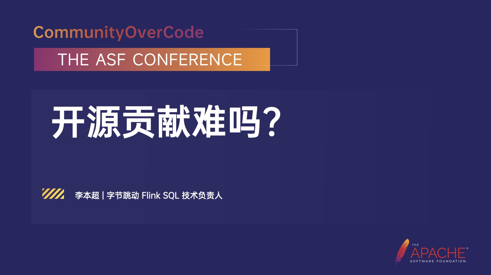

### 主题演讲视频



我目前就职于字节跳动流式计算团队，负责 SQL 引擎的研发工作；我的社区贡献经历主要包括 Apache Flink 和 Calcite 两个项目，我是从19 年开始参与 Flink 社区，有幸在20年6月受邀成为committer；然后是在22年3月开始参与 Calcite 社区，并且在23年1月受邀成为 PMC 成员。
[图片]

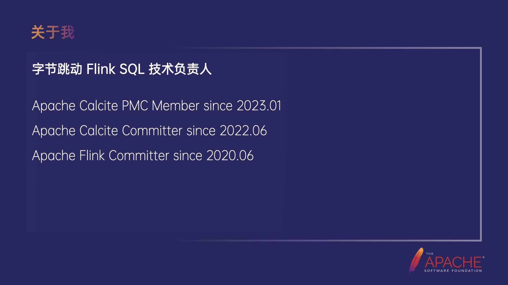

为了准备这个talk，我还专门问了很多同事、和朋友，参与开源贡献有哪些难点，很多人的反应都是工作那么忙，哪有时间参与开源；参与社区门槛太高，不知道怎么开始。

我总结下来主要是这三个问题：

* 一般没有开始参与的同学会感觉没有时间参与，
* 开始尝试参与贡献的又会觉得社区的门槛很高，
* 贡献了一段时间之后发现社区对自己响应太慢，坚持不下来；

而我自己在参与开源的过程中对这几个难点也是深有体会，接下来我就结合自己的开源经历给大家分享一下我是怎么克服这些困难，最终参与到社区里的。

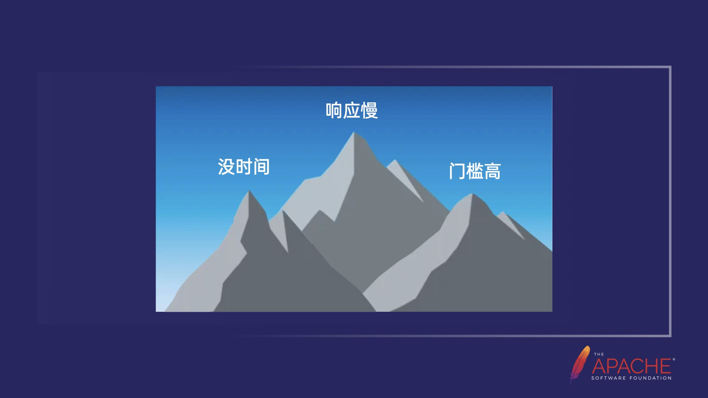

“没有时间”是很多人面临的第一个问题，我自己也是一样的。

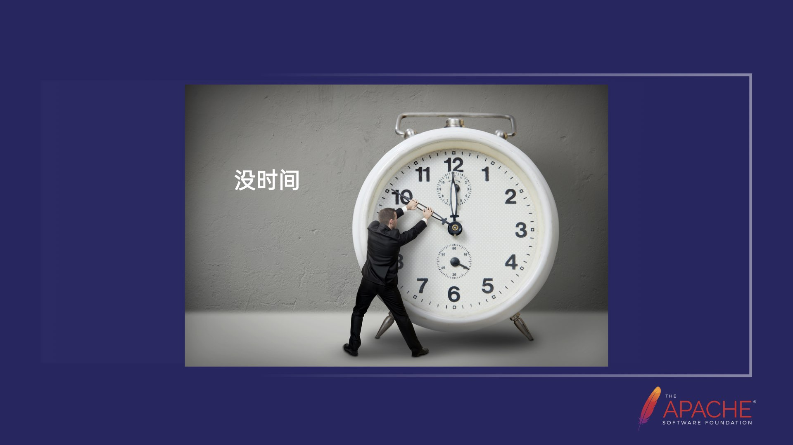

我最开始参与开源是在19年的下半年，当时正是我们在字节内部在推广使用 Flink SQL 的时候，本来内部业务就很忙，白天根本就没有时间，我就利用午休、晚上下班后还有周末的时间了解一些社区的进展，做一些力所能及的事情。我印象很深刻的是，那时候 Flink 社区里的邮件特别多（当然现在也很多），每天有 50-100 封邮件，根本就看不完，我那时候还在手机装上了 google 邮箱客户端，每天在坐地铁的时候也会看一下邮件，了解一下社区的最新进展。

参与了一段时间后我意外的发现，我经常会在晚上十一二点的时候还会收到 review 评论，原来社区里很多人也都是在业余时间参与。有好几次，晚上临睡觉之前收到了 review 回复之后，兴奋的睡不着，就爬进来继续改代码，直到把代码 push 上去才睡得着。当最终看到自己的工作被社区认可，被合并到主分支的时候，是特别开心的，非常有成就感。

其实参与进去之后，时间问题其实就不是问题了，因为我在社区里的工作，很多时候都可以反哺到我的工作。

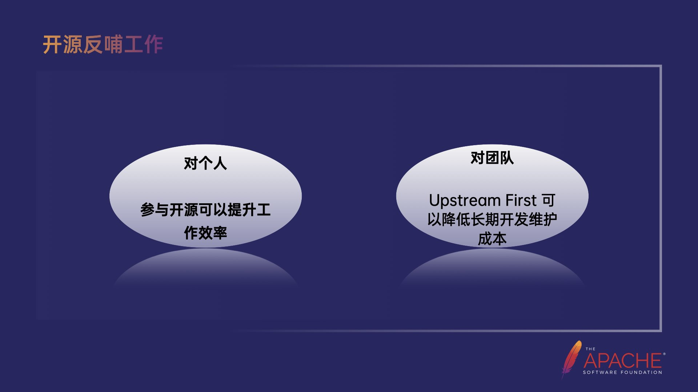

比如好几次，都是因为我在社区里帮别人解答了一些问题之后，在内部用户也遇到了相同的问题，我就可以很快的帮用户解决掉了；而且很多时候我们在内部解决一些问题的时候，由于对系统还不够了解，所以也拿不准解决方案合不合理，这时候我们也会把问题抛到社区里，可以有更资深的同学帮我们把关；甚至于有几次，我们自己碰到了自己完全解决不了的问题，抛到社区里之后也是很快就有人帮我们解决了。感觉自己好像又多了一个强大的虚拟团队。内部工作变的更轻松之后，就可以跟参与社区形成互补，也可以把一些工作节省出来的时间投入到参与社区工作中。

另外，根据我们团队多年的经验来讲，能够做到 [upstream first](https://maximilianmichels.com/2021/upstream-first/) 才是成本最低的方式。什么叫 upstream first 呢？ 就是我们在对开源软件进行修改的时候，优先把这些改动贡献到上游项目中，而不是只在自己 fork 的版本中进行修改。这样我们内部开发和开源社区的开发就可以形成合力，不需要在每个版本进行适配，从长期来看才是成本最低的方式。

所以不管是对个人还是对团队，能够参与到开源社区并进行贡献，都是非常有价值的。

其实参与社区久了之后，就会感觉参与社区反而是一件很轻松愉快的事，就跟我们大学的时候刷论坛一样，没事就去刷一下看看有没有什么有意思的事情。我跟很多有长期参与开源社区经历的朋友聊，很多人都有类似的感受。尤其是在工作遇到了困难搞不定了，或者工作累了想休息一下的时候，就到社区里去放松放松。**如果工作的过程是一个放电的过程，那么参与开源的过程反而就是一个充电的过程。** 对，不光二舅可以治疗精神内耗，开源也可以治疗精神内耗。

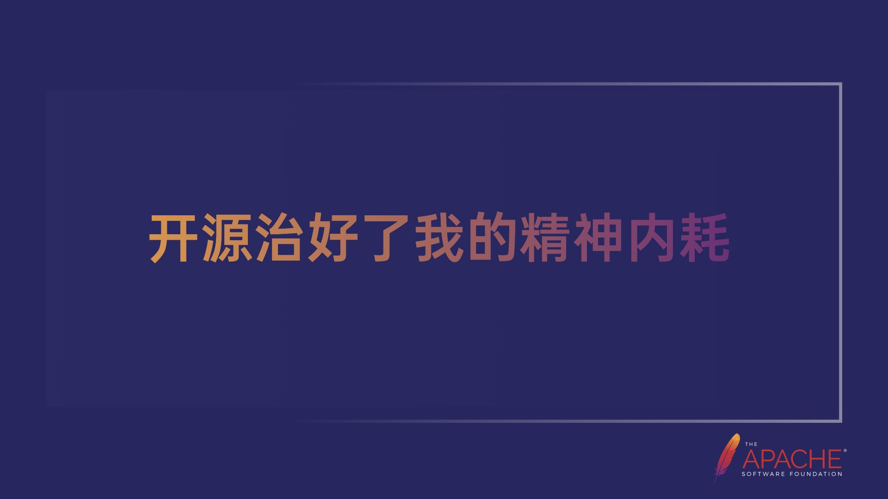

门槛高也是很多同学在参与开源的时候遇到的经常遇到的问题。

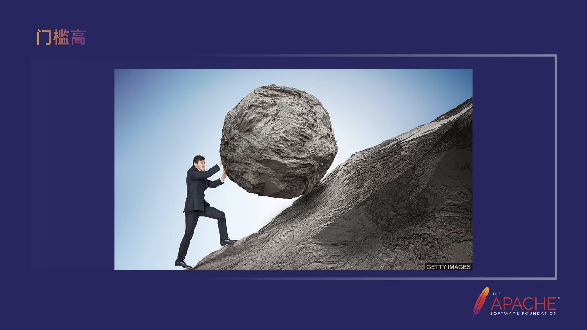

一方面社区的工作模式跟我们平时的工作模式很不一样，需要一个适应的过程，比如需要怎么用邮件列表交流、还需要用英语、很多时候刚进入到社区看到很多问题也看不懂，也不知道那些 issue 适合新手做；另一方面，有很多项目，有比较深的背景知识，入门曲线比较陡峭，代码量也非常高，动不动就上百万行。

刚刚也提到了，我一开始参与 Flink 社区的时候，也是先订阅了社区的邮件列表。那时候每天盯着上百封邮件，大部分也看不懂；也看到很多人在创建新的 issue ，但是感觉也不会做。感觉社区离自己很遥远。而且 google 邮箱底下有一个空间提示，它有 15G 的免费空间，我天天看着这个数字，我就经常在想，每天这么多邮件，我有没有可能在我的邮箱空间用满之前拿到社区的 committer 呢？

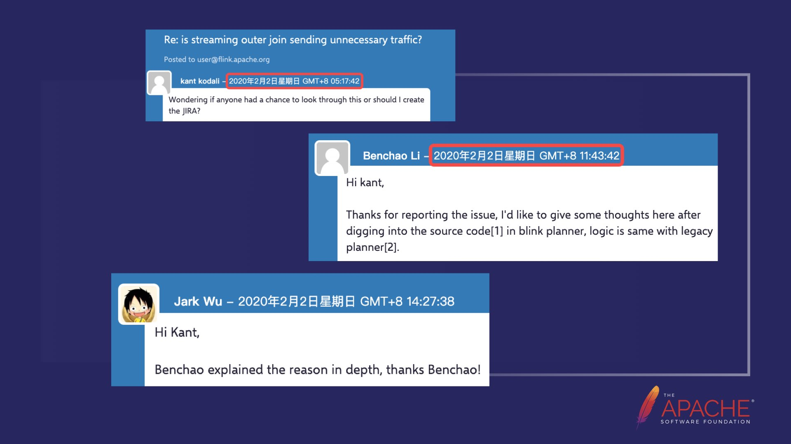

后来有一个周日，我早上起来之后习惯性的打开电脑，查看一下社区的邮件。我就看到有个人外国的小哥提了一个关于 streaming join 原理的问题，而且是提了好几天了还没有人回复，他又重新提了一下。这个问题相对来讲还是比较底层，对当时的我来说还是很具有挑战性的，而且正好我对这个问题也很感兴趣。然后我就想我是不是可以去看看这部分代码，帮解答一下这个问题。然后我就马上开始研究这部分代码，花了两个多小时的时间，终于赶在午饭之前搞懂了这个问题，然后赶紧去社区里回答了一下。（当时在看的过程中内心里还一直在想，社区的大佬们你们千万不要在这个时候回复了，要不然我的功夫就白费了。）后面我的回答也得到了 Flink PMC 云邪老师的认可，这让我开心了好几天，所以那个周末过的特别的愉快。

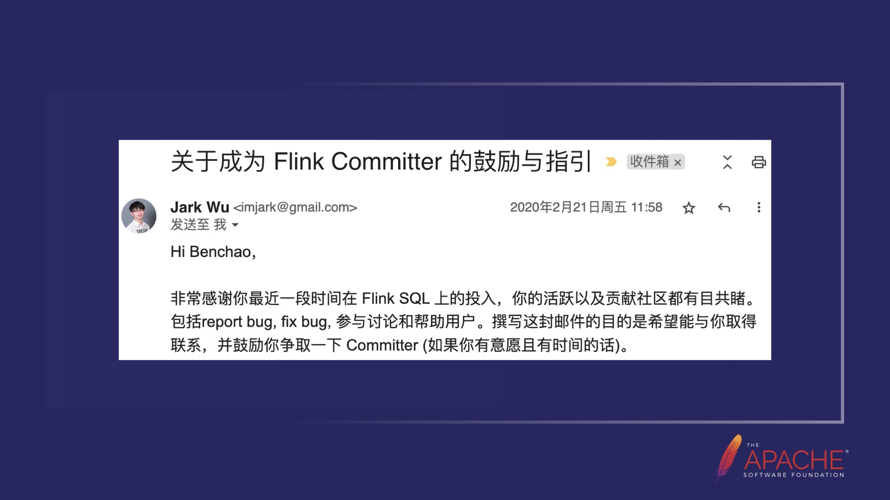

通过这件事之后，我发现，虽然进入社区是有一些门槛，但是只要用对了方法，通过具体问题参与进去，也就没有很难了。后面我就按照这种方式，积极的参与到更多的问题里面，很快就收到了云邪老师发来的鼓励邮件，同时也给了我一些指导意见，比如让我多多参与到更多的事情中，比如可以帮其它人 review 代码、参与一些更大的功能的开发贡献中。当时这封邮件给了我很大的鼓舞，让我有了持续参与下去的动力。

后面我也参与了一些代码 review 的工作，尤其是对着当时社区的 PMC 成员鲁尼、云邪的代码一通 review，有一点初生牛犊不怕虎的感觉。其实我发现，只要是你提的建议是合理的，其实大家就会接受，在这个层面上，大家都是 contributor，都是平等的。所以大家在参与社区的时候可以大胆一些，自信一些。

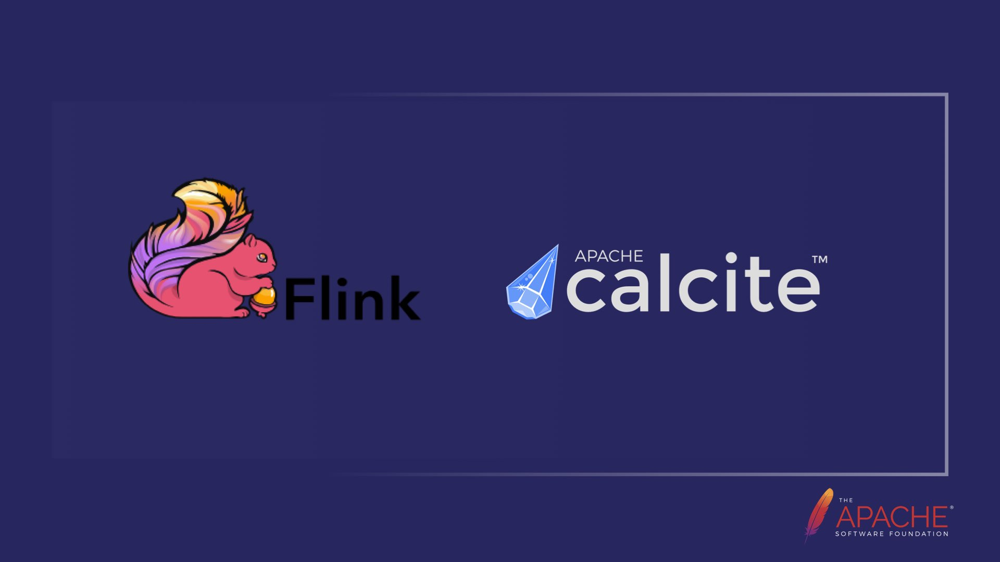

后面在我在搞清楚了 Flink SQL 的原理之后，也了解到其实它背后还有一个项目是 Calcite，SQL 的很多核心工作都是用 Calcite 去完成的，包括像 SQL 的解析、优化等等。然后我就自己开始有针对性的学习 Calcite 的原理，但是学了一段时间之后，我发现 Calcite 的很多核心原理还是挺难搞懂的，一个人学习缺乏交流反馈，很多时候理解的不够深刻，也很容易忘记。

后来机缘巧合，参与到了 Calcite 社区，在社区里跟大家交流切磋，也快速提升了我对整个项目的理解。这个机缘巧合的故事是这样的：

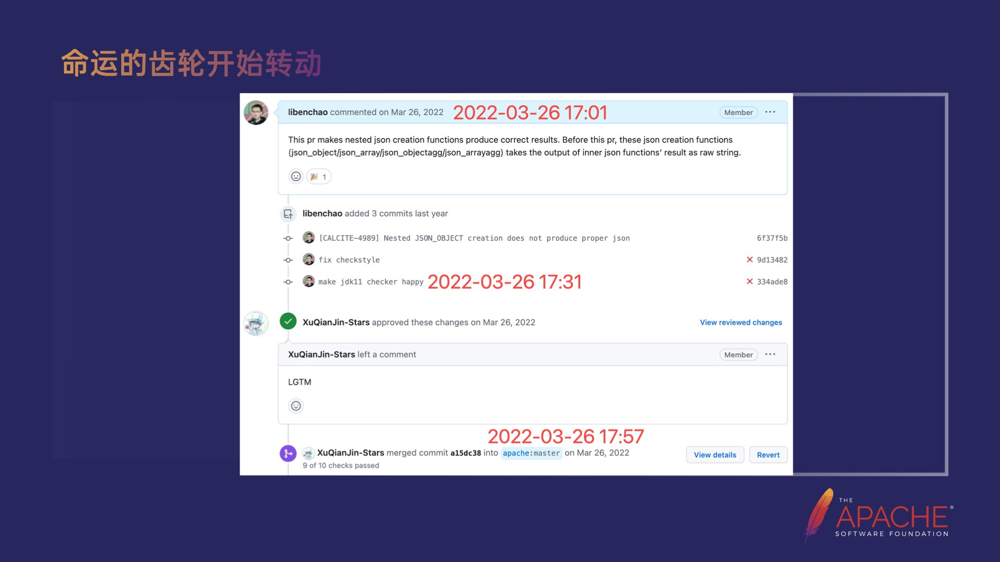

在22年春天的时候，因为特殊原因我开启了一段一个人在酒店里“封闭开发”的经历。 到了周末的时候，非常的无聊，我就在浏览 Calcite 社区邮件的时候，就发现了有一个人报了一个关于 json 嵌套函数的 bug，但是没有人修，然后我就想着反正我也没事，就尝试着帮忙解决一下，正好可以找点事做。没有想到，这个 PR 竟然在不到一个小时内就被 merge 了。受到这种热情的感染，我就开启了我的 Calcite 贡献之路。

参与进去之后，我就发现其实到社区里跟各种大牛直接讨论和学习，才是学习技术最快的方式。

比如像 calcite 项目的发起人 Julian，他有30多年的数据库领域的经验，他也是很多项目的 PMC 成员以及 Apache 的正式成员，在 SQL 领域有非常深厚的造诣，而且还参与过一些 SQL 标准的制定。而且最关键的是他现在仍然非常的活跃，我几乎每天包括周末都能看到他在社区里活跃，指导新同学，也会自己写代码。

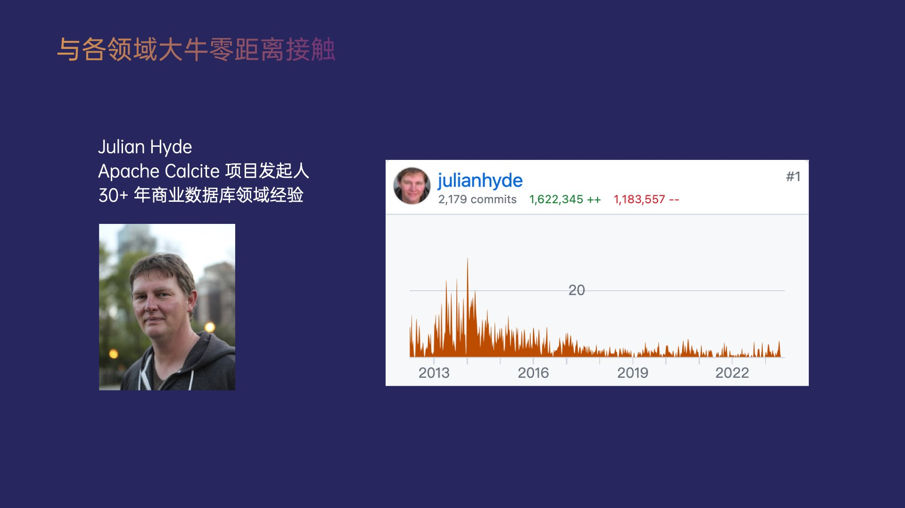

像这种大牛，在我们平时工作中是很难接触到的，但是在开源社区，只要你参与进来，就可以马上跟这些大牛直接交流和学习。

有些同学在参与开源贡献的时候，有时候也会遇到“响应慢”的问题，比如为什么我提了代码没有人给我 review ；为什么我问了一个问题没有人回答；为什么我创建了一个 JIRA 没有人响应。

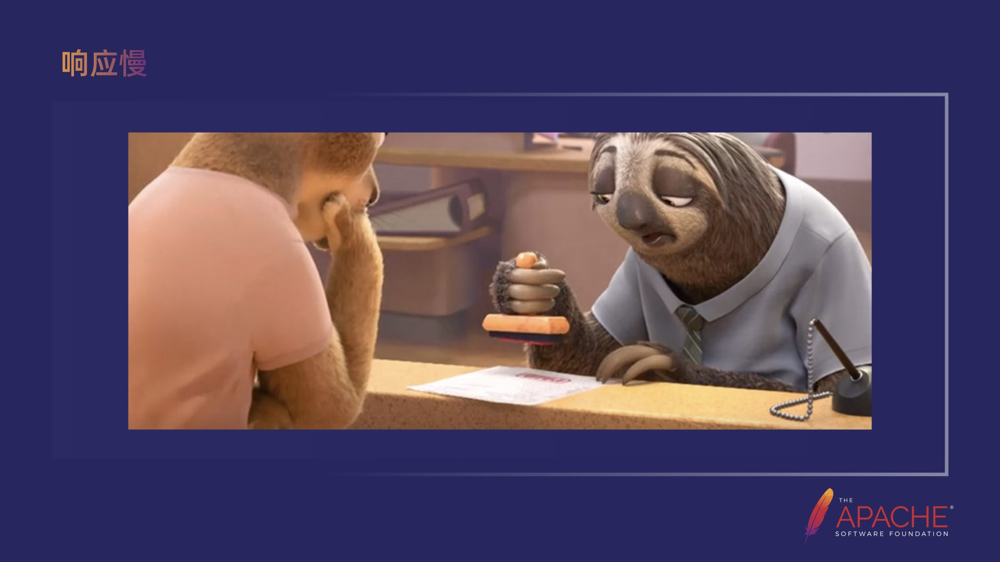

通常响应慢有两方面原因，一方面是社区打开的姿势不对，比如问题说的很不清楚，或者问的问题太大了别人不知道怎么回复，例如为什么报错了，为什么结果不对，比较好的方式是把问题说的越具体越好，最好是能让别人复现你说的问题。

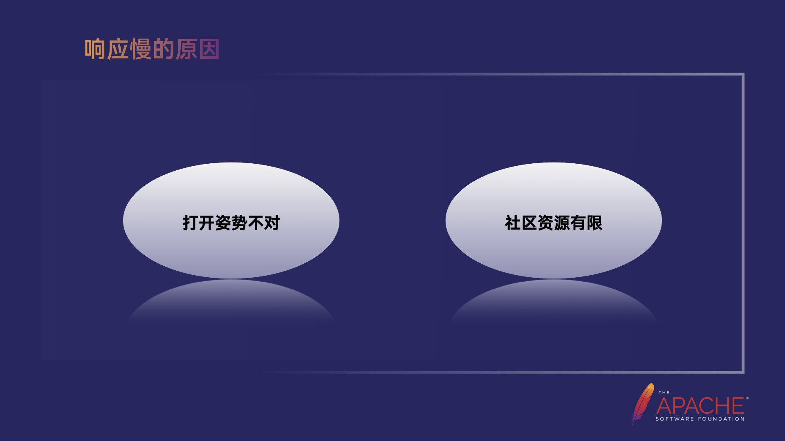

另一方面呢，因为社区也是由志愿者在维护，人力也是有限的，有时候也很难对每个问题都响应的很及时。像 calcite 这样的社区，背后没有直接对应的商业化公司，其实是很缺人的，大家也都是在用业余时间维护开源项目，精力有限; 但是我们也很重视吸收新的 contributor，所以我们会在每个季度给基金会的报告里面，把帮别人 review 合并代码比较多的人给列出来，作为一项单独的奖励。

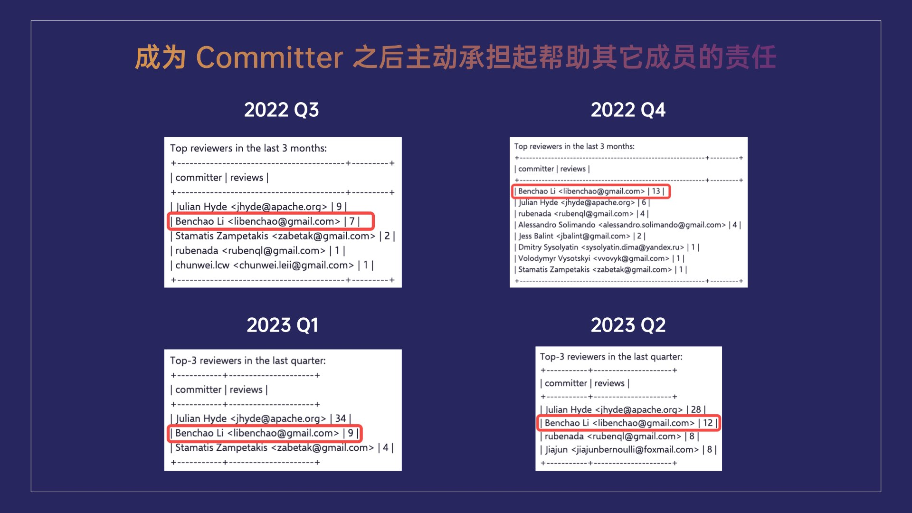

我在社区拿到 committer 之后，也是把更多的精力放到了辅导社区其他 contributor 上，而不是自己开发代码。可以看到我在成为接下来的连续4个季度中，都出现在了 top reviewer 列表中。其中还有一个季度竟然超过了 Julian，我也是后来才知道原来那个季度 Julian 去过圣诞节了，看来想超越大牛并不是一件容易的事。

有时候慢反而也是一种优势，可以让我们把工作打磨的更好，思考的更清楚。

比如我在 [CALCITE-5127](https://issues.apache.org/jira/browse/CALCITE-5127) 这个 issue 上，前后花了5个多月的时间才最终把代码合入，中间代码方案换了好几次，Jira comment 数量多大 50 多个。这个过程其实也是一个很好的跟社区展示我们的能力的时候，包括沟通、耐心、技术深度、对项目的关心等等，其实这个 issue 对我后面提名成为 PMC 成员也是有很大帮助的。

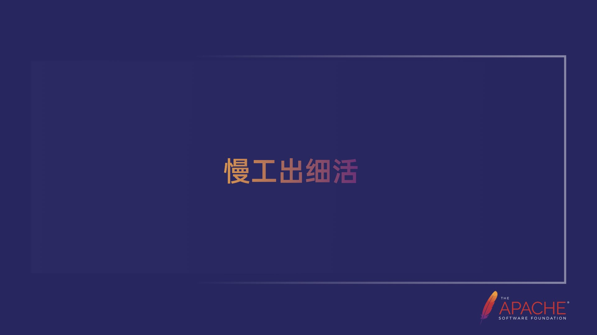

另外就是，社区的工作都是基于相互之间的信任，参与的越多，大家越了解你，对你的信任越多，响应也会更快。所以还是要多多参与，来赢得大家的信任。

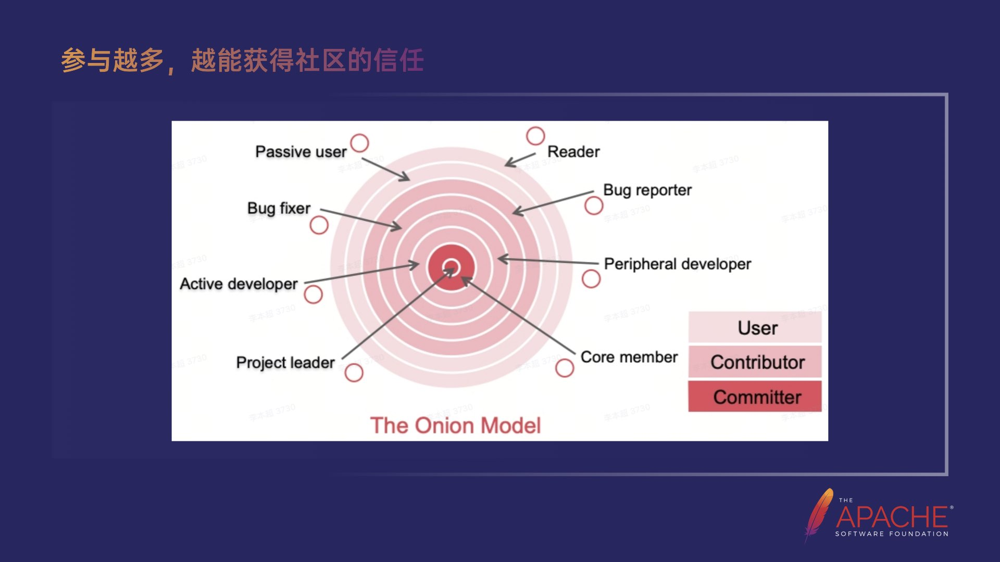

参与社区的确是存在很多的困难，我这一路走来，我总结我能够长期坚持参与社区的动力：可以近距离接触到大牛，跟该领域里最权威的一批人直接对话，获得最快的学习速度，少走弯路；还有很重要的一点就是，我会感觉自己的工作在开源里面的影响范围更广、价值更大。像我们平时在工作中写的代码作用范围就是公司内部；而贡献到开源社区的代码可以影响到所有使用这个项目的地方，分布在全球各地；而我们在公司内的代码生命周期一般也就几年；但是在开源社区的代码生命周期可以到几十年甚至更久，比如 calcite 项目的代码其实就有二十多年的历史了，而且还会存在更久，被越来越多的项目使用到。

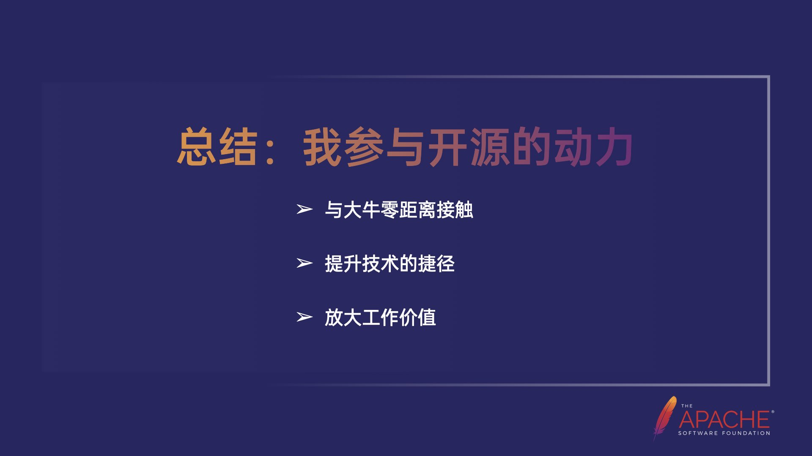

这张图展示的是 Apache committer 的数量，可以看到，Apache committer 的数量每年都在保持比较稳定的增长，越来越多的人加入到开源大家庭里来了。

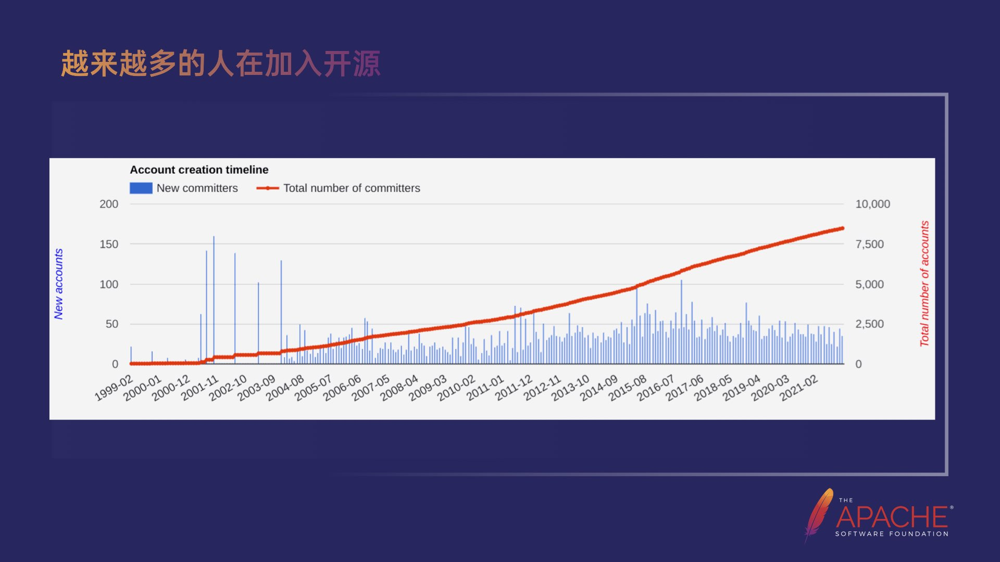

万事开头难，而最好的克服困难的方法最好的方法就是行动；所以如果你也有兴趣参与到开源贡献的队伍中，不要犹豫，马上开始行动起来吧

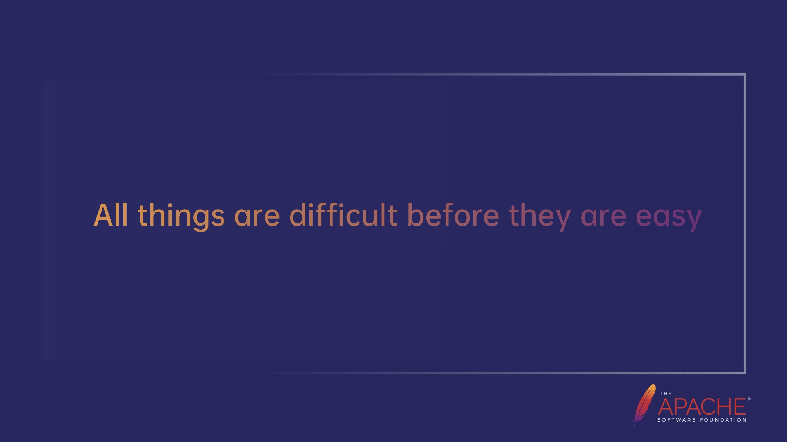

最后希望我的开源小故事可以在大家心里种下一颗小小的开源种子！

