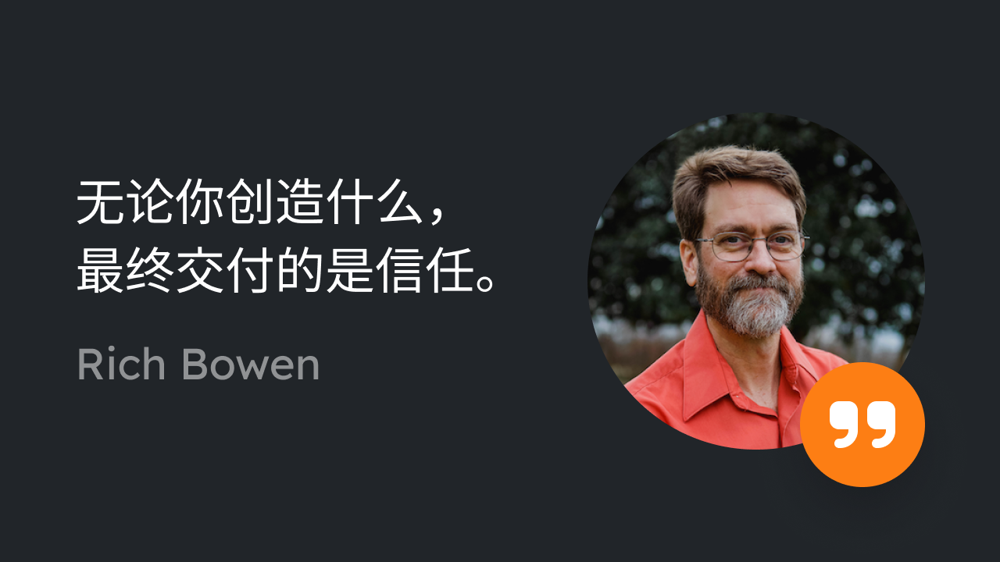
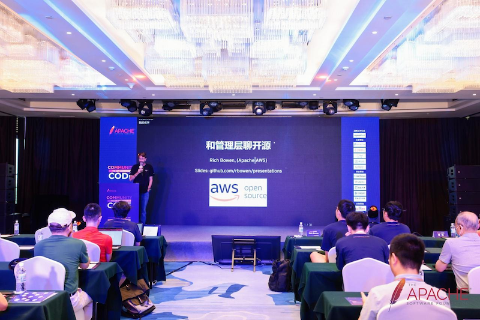
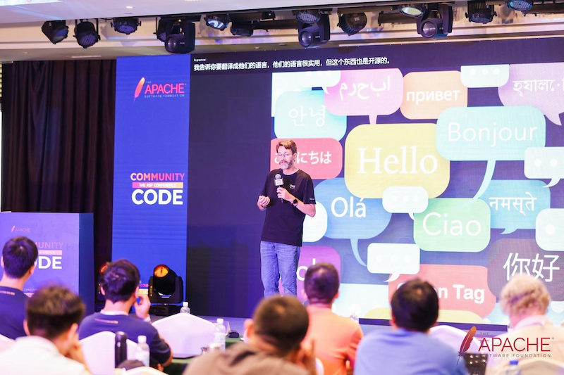
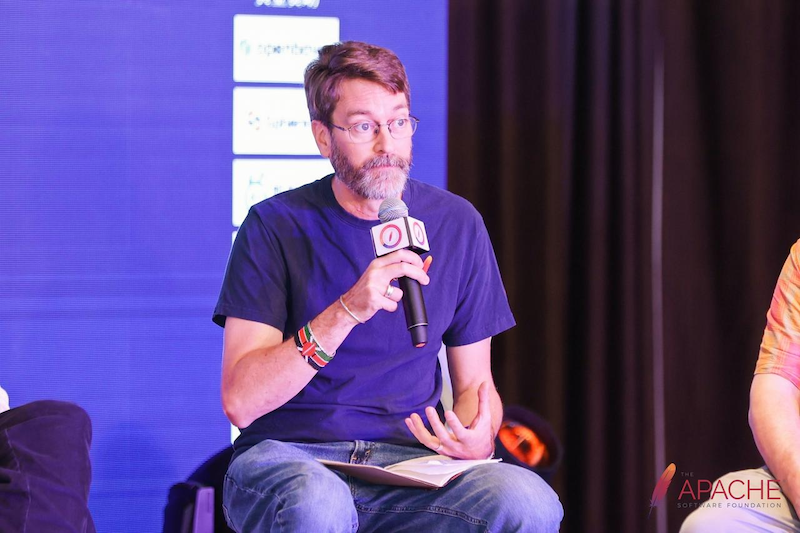
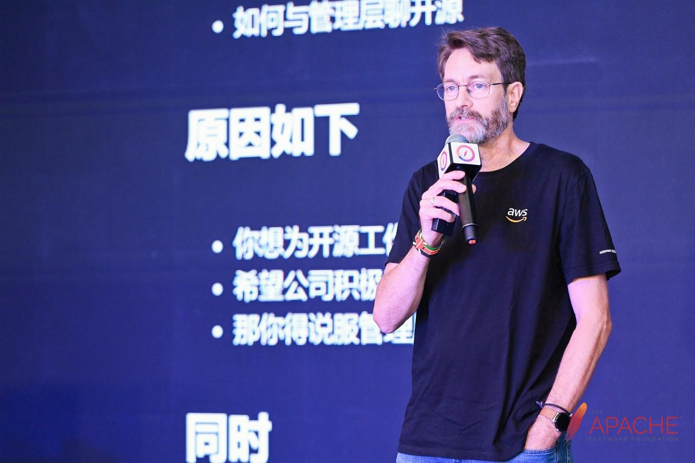

+++
author = "大花"
title = "Rich Bowen: 无论你在创造什么，最终交付的是信任。"
date = "2023-10-06"
description = "2023 年 CommunityOverCode Asia Rich 发表了“与管理层谈论开源”的主题演讲后，我们和 Rich 坐下来一起探讨了演讲背后的更多内容。除了管理层和开源，我们还讨论了 AWS 和 Apache 软件基金会在开源项目中的方法和策略，构建开源生态系统最重要的因素，以及 Rich 是如何平衡不同的角色等话题。"
tags = [
    "开源战略",
    "CommunityOverCode",
    "Open Source"
]
categories = [
  "开源",
  "Apache way",
  "人物访谈"
]
+++ 

早在开源被我们称之为开源，Rich Bowen 就已经参与其中。作为 Apache 软件基金会的成员，Rich 目前担任董事会成员、会议副总裁。此外，他还是 AWS 的开源策略师。这些多重角色赋予了他对开源的更广泛和深刻的理解。



在他于 2023 年 CommunityOverCode Asia 发表了“与管理层谈论开源”的主题演讲后，我们和 Rich 坐下来一起探讨了演讲背后的更多内容。除了管理层和开源，我们还讨论了 AWS 和 Apache 软件基金会在开源项目中的方法和策略，构建开源生态系统最重要的因素，以及 Rich 是如何平衡不同的角色等话题。

**思否：近年来，中国的公司相继设立开源计划办公室。作为一家知名的开源公司，AWS 是如何管理、运营和推广开源的呢？**

Rich Bowen: 总的来说，AWS 和亚马逊从一开始就一直在基于开源进行构建，我们所做的一切都依赖于开源。在亚马逊，我们遵循领导力准则，这些准则影响着我们的思考方式。

第一个准则是顾客至尚。我们始终关注客户并优先满足他们的需求，所以我们构建了所有这些基础设施，而这些产品都建立在开源技术之上。最重要的是，开源项目必须具备可持续性。我们在开源上所做的一切，首先需要确保这些开源项目保持健康的运行。我们还有一项工作是项目选择，如果有多个项目可供选择，我们会尽量选择一个拥有健康生态系统和强大社区的项目。这意味着很多事情，包括众多公司的参与以及透明的项目沟通。接下来，我们会密切关注这些社区，确保它们的生态是健康的，同时我们也会积极参与社区维护，这是最重要也是我们关注的焦点。

我们推广开源的方式不是独立进行的，而是是与社区一起。例如，我们非常依赖 Apache 项目，如 Kafka 和 Airflow 等。我们通过参与他们的会议，比如 Kafka Summit 和 Airflow Summit 去进行推广。通过和社区一起推广，我们可以确保这是社区的看法，而不是亚马逊的看法。此外，我们还会参与社区活动，如 KubeCon 或开源峰会。

**思否：这更像是让公司退居幕后，但对于一些在项目中投入了大量资源的开源公司来说，做出清晰的决策可能会很困难。他们可能会因为投资而模糊界限，或者将项目视为自己的品牌。**

Rich Bowen：的确如此。有时你会对一个开源项目的推广产生疑惑，他们是在谈论项目还是在谈论公司？这很难区分出来。

像任何大公司一样，不同部门之间会存在差异。但作为一名开源策略师，我的工作是参与部门其中，并为他们提供建议，告诉他们我们认为正确的参与方式，即把社区放在第一位，而不是我们自己。

**思否：你能分享一些优秀的 AWS 开源项目吗？**

Rich Bowen：从我的角度来看，Amazon 参与的开源社区主要分为两种类型。一种是主要由亚马逊主导的，另一种是主要由社区主导的。

我们参与的一类开源项目是围绕我们某项服务的，因此除非他们是客户，否则其他人没有真正的动力参与其中。还有一类项目是很多公司参与进来的，比如 Apache Kafka。我主要关注的是第二类项目，也就是真正的社区项目。在亚马逊，我参与的大多数项目实际上都是 Apache 项目。

我最为兴奋的项目之一是 Apache Airflow，因为这是一个亚马逊积极参与的项目。虽然这个项目并不属于亚马逊，但我们有很多全职工程师也参与其中。作为一个社区项目，也有许多其他公司参与其中。我个人认为，这是我们最佳参与项目方式的模型之一。

**思否：在你看来，该如何建立一个开源生态系统呢？**

Rich Bowen：保持沟通透明是最重要的事情。所有关于 Apache Airflow 的讨论都通过邮件进行。我们并不会进行内部会议，然后通知项目：“这是我们做的决定”。相反，我们向社区递交提案，接着在社区中进行讨论和决策。所以，一切的前提是保持公开透明。

第二部分是怀着谦卑去倾听。不是因为我有答案，所以你应该同意我的观点，而是要倾听整个社区的想法，然后共同做出决策。开源领域的早期思想家之一比尔·乔伊（Bill Joy），他创办了 Sun Microsystems 公司。我一直记得他说过的一句话：**不管你在哪家公司工作，世界上最聪明的人都在别处工作。**所以，认为你的团队拥有所有答案是傲慢和短视的。最好的想法总是来自其他地方，所以更应该倾听，因为它们能给你一种新的方式思考。

所以，倾听也是其中一个重要的部分。获取信任很难，而失去信任却很容易，所以你必须赢得社区的信任。尊重他人，礼貌和冷静地倾听，贡献自己的想法，但不要试图强迫别人接受你的观点。

**思否：你既在 AWS 工作，又在 Apache 软件基金会工作，这两者之间有哪些相似和差异？**

Rich Bowen：最显著的差异是动机。公司存在的意义是服务客户和盈利，而 Apache 社区存在的意义是为了公众生产免费软件。

但从某种程度上，两者之间是有一些相似的地方。正如我前面提到的，顾客至尚是我们的首要领导力准则，这和开源项目是一致的。如果不专注用户，那你就失去了意义。

对于一家想要成功的公司，无论用户是否付费，你仍必须把他们都当做你的客户。也许他们未来会付费，也许不会，但你仍需要确保你们在开发人们需要的产品，这在开源领域也是同样适用的。

在繁荣的公司和蓬勃发展的开源社区之间还有一件不变的事物，那就是无论你在创造什么——汽车、服务还是软件——最终你交付的产品还是信任。

您的客户是否信任你？如果他们不信任你，无论你的产品有多好，他们都会离开你，这在开源社区中也是一样的。信任永远是最重要的事情。如果你的开源社区失去用户的信任，无论产品有多好，他们都不会使用它。我们每周都会跟进一些开源项目，这些项目会在不听取社区反馈的情况下做出决策。这种不透明的做法导致了信任的缺失，使得这个项目一夜间流失了所有用户。

**思否：从基金会或者社区的角度来看，当你以处在不同角色的时候，是否存在冲突？也就是说，是否会有一种感觉，认为这样做是错误的？**

Rich Bowen：会的。当存在利益冲突的时候，重要的是坦诚面对，并保持透明。

例如，有一些项目是我所在公司高度依赖的，我可能会想让该项目做出特定的决策。或者当我们的竞争对手参与了该项目，我可能不希望他们成功。因此，在进行这些讨论的时候，对我来说非常重要的一点是，需要坦率地表达出，我在亚马逊工作，这些是我们的利益，这些是潜在的利益冲突。在表述后，我会努力将社区的利益放在首位。

这和之前我提到的观点有关。项目的所有参与是透明的并以上游为先，这两者都很重要。因为如果你在内部先做出决策，然后将其带到项目中，那就没有把项目的利益放在首位。但如果你专注于你的客户和用户，那么你会希望项目能成功。有一句谚语叫水涨船高，这意味着如果我使项目成功，我会帮助我的竞争对手，这是可以接受的。因为涨潮推动了我们所有人，我们一起合作这个项目。看起来我或许在帮助我的竞争对手，但我主要在帮助我的客户。

**思否：那么管理层应该关注开源的哪些方面，以及为什么这些方面尤其关键？**

Rich Bowen：我认为管理层最需要理解的一点是，开源是供应链的一部分。

无论你的产品是什么，都需要其他地方的原材料和自然资源。如果你只是消耗，那么最终将耗尽资源。如果我们把开源看作是我们的原材料，那么我们有责任确保这一原材料源头的健康。如果你是一名木匠，你会希望确保森林始终存在，你会种植新的树木，而不仅是砍伐。因此，我试图向管理层传达，我们的责任是维持可持续性。我们有责任确保我们依赖的项目是健康的。

历史上，有许多公司构建了开源的业务模式，却没有回馈社区，这导致了几种情况。其中一种情况是，项目可能会对你产生敌意，并寻找方法来反对你。最终，你可能会陷入这样一种情况，你在某个基础上构建了产品，但该项目可能更改了许可证，将你排除在外。

另一种情况是，如果您不积极参与，那么在项目决策中，你就没有发言权。也许项目会朝着不符合你的利益方向发展。因此，积极参与供应链其中是至关重要的。这一点不仅在软件领域如此，对于任何业务来说都是如此。如果你依赖煤炭，那么你应该了解煤炭业务的运作方式，以便可以提前几个月或几年看到将出现的问题。这对我来说是最重要的事情。

最后一个是信任，这又与透明有关。你需要确保与项目进行开放的沟通，并且不做出让社区感到恼火、尴尬或贬低社区的决策或营销方式。你需要给予向那些正在工作的人正确的赞誉，并按这种方式去做事。

**思否：你提到了使用和应用开源软件，这让我想到了另个话题：贡献。管理团队在使用、贡献或应用开源软件时会面临哪些挑战？又该如何解决这些挑战呢？**

Rich Bowen：我认为企业在与开源合作时面临的最大困难，我在昨天的圆桌讨论中也提到过，就是要有耐心。当你尝试在开源项目中做出决策时，需要进行讨论，而不能仅仅让你的经理说：“这就是我们要做的方式。”

有时，你必须等待数天甚至数周才能做出决策，而这对于需要发布产品的公司来说是非常沮丧的。例如，我有一个产品发布的截止日期，还有需要在即将到来的发布会上宣布新功能。而在开源项目中，你不能这么做。这就是一个挑战，你需要向管理层解释他们为什么应该等待。

我们以客户为导向，而用户就是我们的客户，所以我们应该等待。我们需要确保我们有时间和耐心等待用户的反馈。当我对一个新功能有了很好的想法，我会感到兴奋并想要推出它，然而用户认为这不是一个好主意，那么最终这个功能将失败，所以我们需要等待。你甚至可以将其当作为市场研究，而来自社区的用户反馈是值得等待的。参与项目的开发人员代表了他们自己，他们是最了解产品也是最有经验的用户。所以我们必须确保他们在决策过程中，而这使得和管理层沟通截止日期的问题变得很难。

**思否：管理层代表着公司，和开源其实是有天然的冲突。那么，你将如何说服管理层，理解开源的概念有助于策略调整以实现业务目标？**

Rich Bowen: 回到之前的问题，我认为让他们理解原材料和供应链是很有用的隐喻：如果我们售卖牛奶，那就不应杀掉奶牛。

如今，有些人会说，“那我们应该买下奶牛，不理会农民，我们应该自己做这些事情。”对于一家企业来说，理解自己在哪些领域有独特的优势，以及舍弃哪些领域是很重要的。因此，你可以在共同的领域进行合作，而专注于具有独特优势的领域。

例如，AWS 完全致力并擅长托管网络服务。我们在世界各地都有数据中心，我们拥有庞大的规模、快速的网络和才华横溢的系统管理员。但我们运行的软件是由全世界和整个社区共同开发的，我们与他人分享这些资源。然后，我们专注于我们独特擅长的领域。

我在红帽工作了九年。红帽并不是一家软件公司，它出售技术支持服务而不是软件。我会建议销售人员不要强调自己是世界上最优秀的软件生产商，因为软件是由社区共同开发的，而我们擅长的是销售支持服务。这是我在红帽工作期间思考了很久得出的结论，而在AWS也有着相似的情况。

你可以访问 Rich 的博客 [DrBacchus.com](https://drbacchus.com/)，了解更多关于他对于开源的想法和见解。

**作者: 大花**

Anne Zhu is the community manager of Answer, SegmentFault. 大花是思否旗下开源问答软件 Answer 的社区经理。
