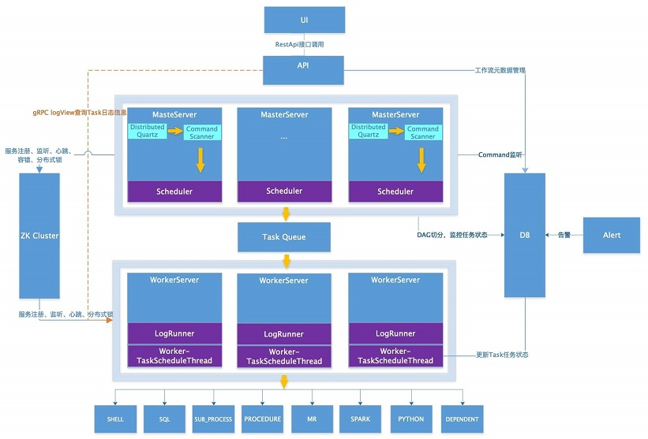

+++
author = "代立冬,李岗"
title = "DolphinScheduler介绍"
date = "2020-03-15"
description = "The introduction about DolphinScheduler"
tags = [
    "The introduction about DolphinScheduler",
]
+++
# DolphinScheduler介绍
DolphinScheduler，简称”DS”, 中文名 “小海豚调度”（海豚聪明、人性化，有左右脑可互相换班，终生不用睡觉）。希望 DolphinScheduler 就像它的名字一样，成为一个“开箱即用”的灵活易用的调度系统。
## 1概述
DAG 全称Directed Acyclic Graph，简称DAG。工作流中的Task任务以有向无环图的形式组装起来，从入度为零的节点进行拓扑遍历，直到无后继节点为止。

Apache DolphinScheduler（目前处在孵化阶段）是一个分布式、去中心化、易扩展的可视化DAG工作流任务调度系统，其致力于解决数据处理流程中错综复杂的依赖关系，使调度系统在数据处理流程中开箱即用。

DolphinScheduler是2019年开源的一个调度系统，在去年美国时间2019年8月29号，分布式任务调度引擎DolphinScheduler（原EasyScheduler）正式通过顶级开源组织Apache基金会的投票决议，以全票通过的优秀表现正式成为了Apache孵化器项目！

## 2背景
在2017年，易观在运营自己6.8Pb大小、6.02亿月活、每天近万个调度任务的大数据平台时，受到ETL复杂的依赖关系、平台易用性、可维护性及二次开发等方面掣肘，易观的技术团队渴望找到一个具有以下功能的数据调度工具：

易于使用，开发人员可以通过非常简单的拖拽操作构建ETL过程。不仅对于ETL开发人员，无法编写代码的人也可以使用此工具进行ETL操作，例如系统管理员和分析师；
解决“复杂任务依赖”问题，并且可以实时监视ETL运行状态；
支持多租户；
支持许多任务类型：Shell，MR，Spark，Flink，SQL（mysql，postgresql，hive，sparksql，clickhouse等），DataX，Sqoop，Python，Sub_Process，Procedure等；
支持HA和线性可扩展性。
易观技术团队意识到现有开源项目没有能够达到他们要求的，因此决定自行开发这个工具。他们在2017年底设计了DolphinScheduler的主要架构；2018年5月完成第一个内部使用版本，后来又迭代了几个内部版本后，系统逐渐稳定下来。

## 3特点
DolphinScheduler提供了许多易于使用的功能，可加快数据ETL工作开发流程的效率。其主要特点如下：

 * 通过拖拽以DAG 图的方式将 Task 按照任务的依赖关系关联起来，可实时可视化监控任务的运行状态；
 * 支持丰富的任务类型；
 * 支持工作流定时调度、依赖调度、手动调度、手动暂停/停止/恢复，同时支持失败重试/告警、从指定节点恢复失败、Kill 任务等操作；
 * 支持工作流全局参数及节点自定义参数设置；
 * 支持集群HA，通过 Zookeeper实现 Master 集群和 Worker 集群去中心化；
 * 支持工作流运行历史树形/甘特图展示、支持任务状态统计、流程状态统计；
 * 支持补数，并行或串行回填数据。

## 4系统架构
DolphinScheduler 是从数据处理的痛点出发，其解决的问题以及优化的方向主要有以下 5 点：

 * 可视化流程设计减轻了开发者配置工作流的复杂度，从繁琐的基础配置中解放出来，不用再靠编程来配置流程，提升开发效率；

 * 扩展性强，在当下这样一个业务变化快、技术迭代频繁的现在，丰富的任务类型、跨语言和自定义插件机制良好的可扩展性，无疑使这款框架具备了更长的寿命和更广泛的落地场景；

 * 支持工作流定时调度、依赖调度、手动调度、手动暂停 / 停止 / 恢复，同时支持失败重试 / 告警、从指定节点恢复失败、Kill 任务等操作

 * 支持集群 HA，通过 Zookeeper 实现 Master 集群和 Worker 集群的天然去中心化架构设计，使得系统的高可用性得到保证；

 * 通过拖拽以 DAG 图的方式将 Task 按照任务的依赖关系关联起来，可实时可视化监控任务的运行状态，完善的服务监控系统，方便运维人员快速进行问题定位。

目前，中国平安、美团、嘀嗒出行、多点互动等多家企业都已经将 Apache DolphinScheduler 应用到了实际场景中。

## 5开源推进路线

万丈高楼平地起，从项目启动的那一刻，我们就确定了开源的目标，从那一刻，开源的种子就种在了每一位项目成员的心中，它是一个使命，
也是所有人的共识和承诺。

要采用模块化的设计，这样才能便于开源后的协同开发；
要选用开源的技术组件，这样才能便于开源后让更多的开发者参与进来；
大道至简，一定要做到开箱即用，我们调度的名字就叫EasyScheduler。
...
就这样，伴随着每一位的手舞足蹈，热情澎湃和唇枪舌剑，2017年12月在北京市朝阳区恒通商务园B12栋3层办公室里，拉开了EasyScheduler的序幕。

使命必达、分秒必争，每一位伙伴都自动自发、随时待命。

2018年5月，EasyScheduler在易观千帆成功上线使用。

2019年3月，开放给外部种子用户使用，正式发布第一个开源版本1.0.0。

2019年5月，相继推出了1.0.1、1.0.2和1.0.3版本。

开源的种子早已种下，只有破土而出，才能扎根于大地。
ASF作为全球最大的开源基金会，一直致力于开源软件生态的营造，让软件技术能够在全球共享，这是ASF无比耀眼的魅力所在。

我们要扎根apache，我们要进入到全球最大的开源组织，让我们的项目在全球共享，于是我们决定正式探索apache开源之路。

这是一个0到1的问题，这是一个需要拿到入场券资格的问题，那么如何才能够进入apache呢？
    一个项目如果希望进入到apache孵化器，至少需要1名Champion和2名mentor。所以我们的第一个难题就是如何找到champion和mentor.
ASF孵化器拥有导师200多位，然而活跃的中国导师不超过5位，ALC Beijing也没有成立，我们只能四处询问，八方求援，经历了无数次的尝试，甚至出现了一丝丝的动摇，
但是我们马上就想到团队每一个人的付出和努力、想到那些默默支持我们前行的用户、想到一开始就种在我们心中的开源之梦，
我们坚信有信念就一定有远方，有梦想就一定有希望，我们坚信彩虹一定会出现，最终我们幸运地迎来了我们的champion和mentor。

至今仍清晰记得初见吴晟老师的场景：吴晟老师用了将近一下午的时间给我们普及了apache孵化器的一些标准和apache way，我们也从最开始的喜悦兴奋变为了默默沉思。
第二个迎头重击就是apache的license协议，我们需要检查所有的依赖是否符合license许可，否则就需要修改，于是又经过了几个月的重构和升级。
这里还有一个小插曲，我们在申请进入Apache孵化器过程当中，发现Easy Scheduler不是全球唯一的名字，于是又进行了投票最终选中了
DolphinScheduler.

所幸我们一直坚定着信念，天道酬勤，当美国时间2019年8月29号DolphinScheduler全票通过正式成为apache孵化器项目的时候，
每个人都洋溢着开心的笑容，但是我们又很快的冷静下来，真正的apache way也许才刚刚开始。

第一次的apache release，是孵化过程中很重要的一个里程碑。DS用了4个月的时间发出了第一个apache release，一个很大的原因
就是起初代码层面上关注较多，而Apache对于license和商标有着近乎严苛的要求，在release的时候会进行非常仔细地检查，
字体的版权或者某个前端组件使用的license不合规范都会结束一周左右的发版流程。

经历过第一次apache release发版后，会对apache Community Over Code的名言有着更切身的体会，成功的开源项目最重要的因素就是：
社区、社区还是社区。时间仿佛回到了吴晟老师给我们首次讲述apache way的那个下午：
“Apache 是一个透明、开放的社区，需要让工作的人来决定；如果一件事情没有出现在邮件列表中，那它就没有发生；
Apache 社区是一个公开、平等、精英治理的社区；Apache更多的是给一个思路，很多时候没有一个固定的规则和流程。。。”

感谢吴晟老师、史少峰老师、陈亮老师、Furkan Kamaci老师和Kevin Ratnasekera老师。
感谢每一位使用过DS的用户、每一位参与过DS社区贡献的伙伴，感谢你们愿意牺牲自己宝贵的时间与我们一同前行，一个star，一个issue，
一篇文章、一行代码、一封邮件列表，参加一场meetup的举办，这都是我们一起同在的见证！也期待更多的伙伴加入到DS社区，
我们一起披荆斩棘、一起高歌猛进！一起经历风雨、一起见证胜利！

## 欢迎加入DS社区
* https://github.com/apache/incubator-dolphinscheduler (请记得fork和star)
### 订阅邮件列表
 * 用自己的邮箱向dev-subscribe@dolphinscheduler.apache.org发送一封邮件，主题和内容任意。

 * 接收确认邮件并回复。 完成步骤1后，将收到一封来自dev-help@dolphinscheduler.apache.org的确认邮件（如未收到，请确认邮件是否被自动归入垃圾邮件、推广邮件、订阅邮件等文件夹）。然后直接回复该邮件，或点击邮件里的链接快捷回复即可，主题和内容任意。

 * 接收欢迎邮件。 完成以上步骤后，会收到一封主题为WELCOME to dev@dolphinscheduler.apache.org的欢迎邮件，至此已成功订阅Apache DolphinScheduler（Incubating）的邮件列表。

## 如何成为 ALC Beijing的成员

ALC Beijing 欢迎任何人的参与！不设置任何门槛，只有有意愿传播 Apache 以及开源之道的小伙伴都可以参与进来！具体的方式如下：
 * 加入我们的活动。大家可以通过关注ALC Beijing公众号获取最新的活动信息，并参加我们的线上或者线下的活动。
 * 成为ALC Beijing会员。ALC Beijing作为一个公益组织，需要大量的志愿者的来帮助协调和组织活动。志愿者成为会员的原则和Apache软件基金的其他项目发展Committer以及PMC成员的方式一样, 基于志愿者在社区中的贡献，采用投票邀请方式成为ALC Beijing 会员。

## 参考链接
[1] https://dolphinscheduler.apache.org/zh-cn/index.html

[2] https://www.infoq.cn/article/SeODu1bwlyjCUR70t6KD

